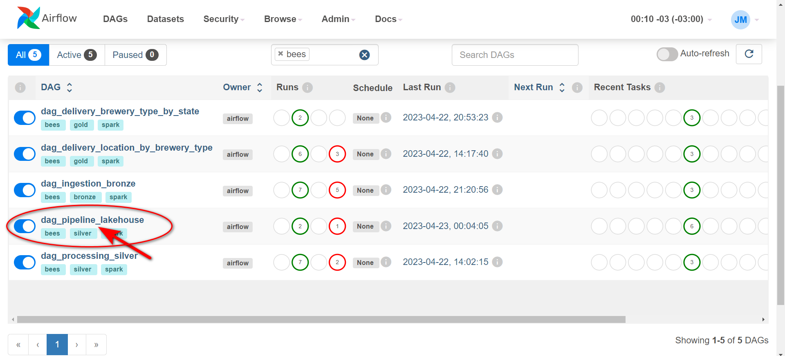

# Consume data from an API, and persist into a data lake 

Select Language: **English**, [Portuguese](https://github.com/jeffersondasilvamartins/pipeline-lakehouse-brewery)

This project involves the creation of a data lakehouse using  [Medallion Architecture](https://www.databricks.com/glossary/medallion-architecture)

Basically, consuming an API, processing the data, and delivering aggreted tables.

## Flow Architecture


## Data Source
To consume an API, the [Projeto Open Brewery DB](https://www.openbrewerydb.org/) was used, which is open data from breweries.

## Data Lakehouse
Following layers:

- ***Bronze*** - data whitout any transformation and inserted metadata
- ***Silver*** - data with some transformation and inserted metadata
- ***Gold*** - aggregated data according to business rules

The followiong tools were used for this solution:
- ***Apache Spark*** - processing engine 
- ***Apache Airflow*** - orcherstration of DAGs
- ***Delta Table*** - optimezed storage layer

## Folder structure
* dags
* scripts
    * spark
    * sql


In the `dags`, the code responsible for defining the DAG.

In the `scripts/spark`, the pyspark code responsible for loading the data.

In the `scripts/sql` the *SELECT* to create the business table. 


***

## Execution of DAGs
The loading of the tables is carried out by executing the DAG in Airflow according to the steps below.

1. Airflow interface <p>
Click on the `Airflow UI` link to be directed<p>


2. DAG<p>
Clik on the `dag_pipeline_lakehouse` to access the DAG<p>

3. Running the DAG<p>
**Finally**, click on play to start the execution <p>

4. Follow-up<p>
A new run column will appear<p>
<p>
Execution progress will be signaled by a change in column color<p>


> **Wait for all steps to finish**


***
## :rocket: Storage

:closed_lock_with_key: Connect to Linux<p>
To check the created files, you will need to connect to remote machine.

Open a terminal (*for Linux*) or a command line (*for Windows*) or your computer:

#### Step by step 
1. Enter the command
```bash
-> ssh lahouse@xx.xxx.xxx.xx
# 👇 The connection will prompt you for a password. Once the connection is established, your prompt should according to the screen. 👇
```


2. Go to the lakehouse directory
```bash
lakehouse@ubuntu-s-4vcpu-8gb-intel-fra1-01:~$ cd lakehouse

# 📁 File structure
.
├── bronze
│   └── brewery
├── gold
│   ├── brewery_type_by_state
│   └── location_by_brewery_type
└── silver
    └── brewery
```
📌 Check the sub-directories to see created files
***

<a href="https://www.digitalocean.com/?refcode=20e91ebaafe6&utm_campaign=Referral_Invite&utm_medium=Referral_Program&utm_source=badge"></a>
