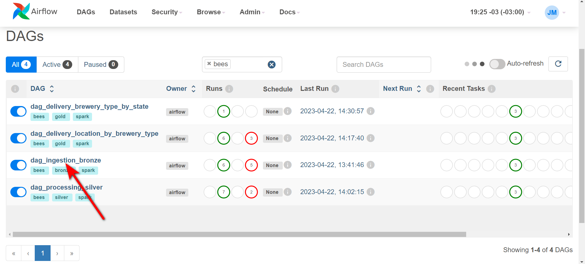
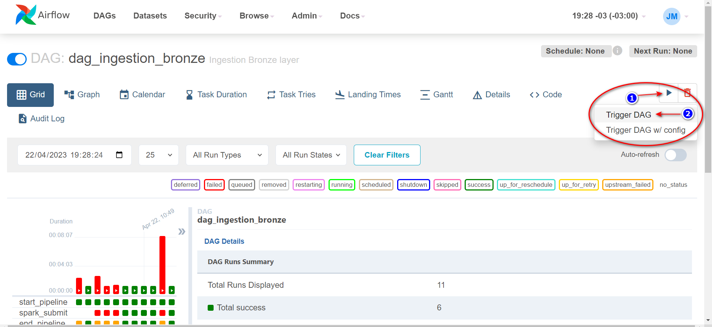
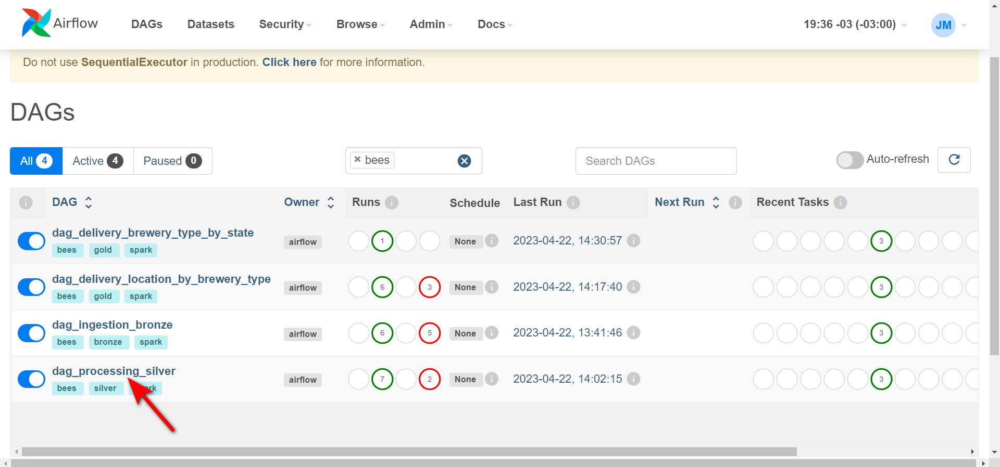
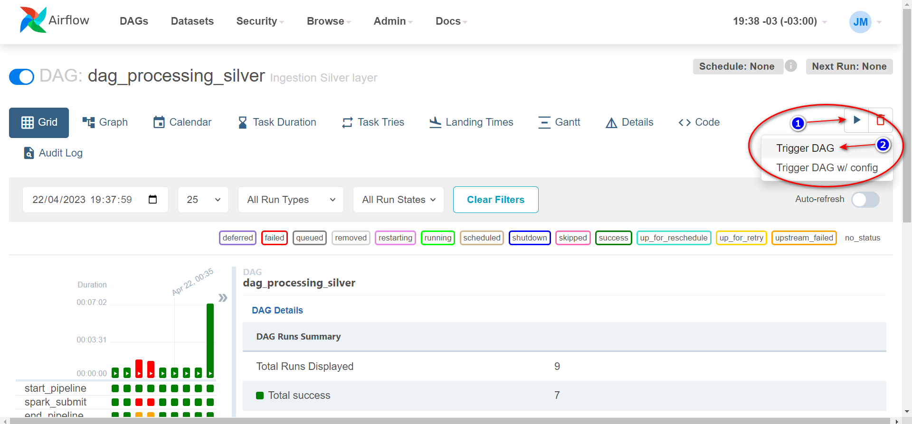
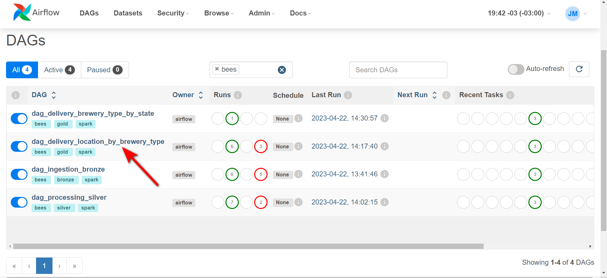
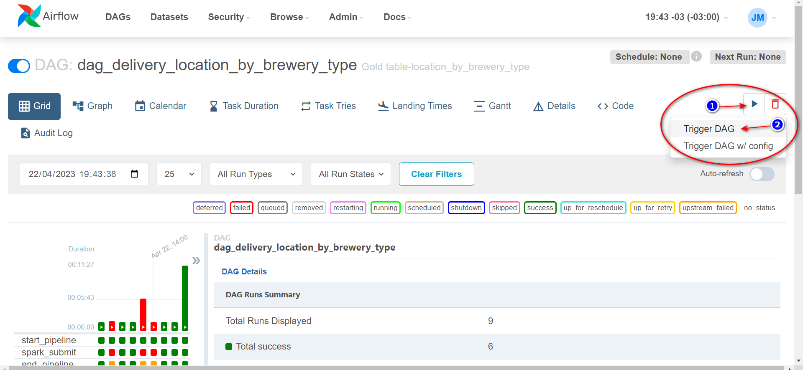
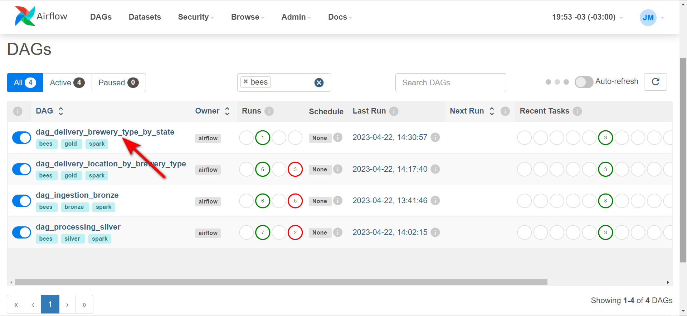
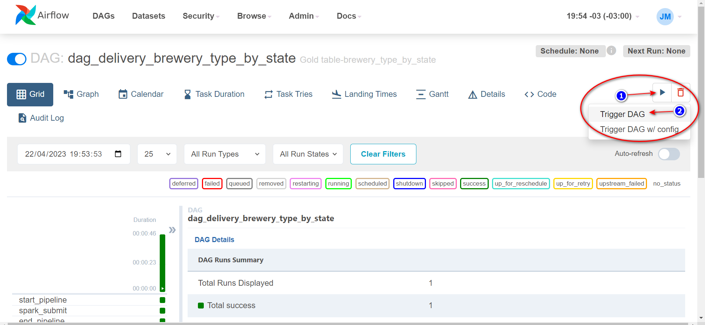

# Consumindo API e persistindo num Data Lakehouse
Criação de um Data Lakehouse utilizando arquitetura [Medallion Architecture](https://www.databricks.com/glossary/medallion-architecture)

Basicamente consumindo uma API, realizando tratamento dos dados e entregando tabelas agregadas.


## Arquitetura do fluxo


## Data Source
Para consumir uma API foi utilizado o [Projeto Open Brewery DB](https://www.openbrewerydb.org/) que são dados abertos de cervejarias.

## Data Lakehouse
Dividido nas seguintes camadas:

- ***Bronze*** - dados sem nenhuma transformação e inserido metadado
- ***Silver*** - dados com alguma transformação e inserido metadado
- ***Gold*** - dados agregados conforme regra de négocio

Para essa solução foi utilizado as seguintes ferramentas:
- ***Apache Spark*** - engine de processamento 
- ***Apache Airflow*** - orquestração das DAGs
- ***Delta Table*** - camada de armazenamento otimizada

## Estrutura de pasta
* dags
* scripts
    * spark
    * sql

Na pasta `dags` temos o código reponsável pela definição da DAG 

Na pasta `scripts/spark` temos o código pyspark responsável pela carga dos dados

Na pasta `scripts/sql` temos o *SELECT* para criação da visão de negócio

***
## Execução das DAGs
Clique no link para ser direcionada para a `Airflow UI` 


### Executar carga camada Bronze
Clicar no link = `dag_ingestion_bronze` em seguida no play conforme imagens abaixo



### Executar carga camada Silver
Clicar no link = `dag_ingestion_silver` em seguida no play conforme imagens abaixo


### Executar carga camada Gold
1. ***Visão location_by_brewery_type***<p>
Clicar no link = `dag_delivery_location_by_brewery_type`  em seguida no play conforme imagens abaixo


2. ***Visão brewery_type_by_state***<p>
Clicar no link = `dag_delivery_brewery_type_by_state`  em seguida no play conforme imagens abaixo



## Acessando repositório

Abrir um terminal (acesso via ssh) e na linha de comando digitar a seguinte linha:


### Check directory
```bash
cd /root/lakehouse
```

- item 1
* item 3


## <a id="anchortext" />Header text
<p>

To go to a section on the same page:
[text](#anchortext)
