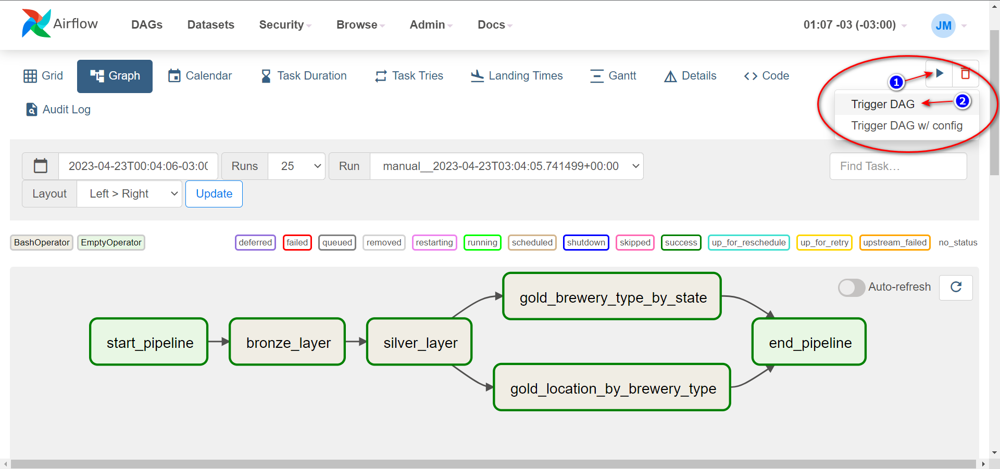

# Consumindo API e persistindo num Data Lakehouse


Criação de um Data Lakehouse utilizando arquitetura [Medallion Architecture](https://www.databricks.com/glossary/medallion-architecture)

Basicamente consumindo uma API, realizando tratamento dos dados e entregando tabelas agregadas.


## Arquitetura do fluxo


## Data Source
Para consumir uma API foi utilizado o [Projeto Open Brewery DB](https://www.openbrewerydb.org/) que são dados abertos de cervejarias.

## Data Lakehouse
Dividido nas seguintes camadas:

- ***Bronze*** - dados sem nenhuma transformação e inserido metadado
- ***Silver*** - dados com alguma transformação e inserido metadado
- ***Gold*** - dados agregados conforme regra de négocio

Para essa solução foi utilizado as seguintes ferramentas:
- ***Apache Spark*** - engine de processamento 
- ***Apache Airflow*** - orquestração das DAGs
- ***Delta Table*** - camada de armazenamento otimizada

## Estrutura de pasta
* dags
* scripts
    * spark
    * sql

Na pasta `dags` temos o código reponsável pela definição da DAG 

Na pasta `scripts/spark` temos o código pyspark responsável pela carga dos dados

Na pasta `scripts/sql` temos o *SELECT* para criação da visão de negócio


***

## Execução das DAGs
Clique no link para ser direcionada para a `Airflow UI` 


### Executar carga do Pipeline
Clicar no link = `dag_ingestion_bronze` em seguida no play conforme imagens abaixo


***
## :rocket: Acessando Storage

:closed_lock_with_key: Conectando Virtual Machine<p>
>_Máquina Windows instalar algum aplicativo para conexão ssh_

Abrir um terminal:

#### Step by step 
1. Conexão via ssh
```bash
ssh user@xx.xxx.xxx.xx
```
2. Ir pra a pasta principal
```bash
cd lakehouse

# Árvore das demais pastas correspondendo as camadas da arquitetura
.
├── bronze
│   └── brewery
├── gold
│   ├── brewery_type_by_state
│   └── location_by_brewery_type
└── silver
    └── brewery
```
