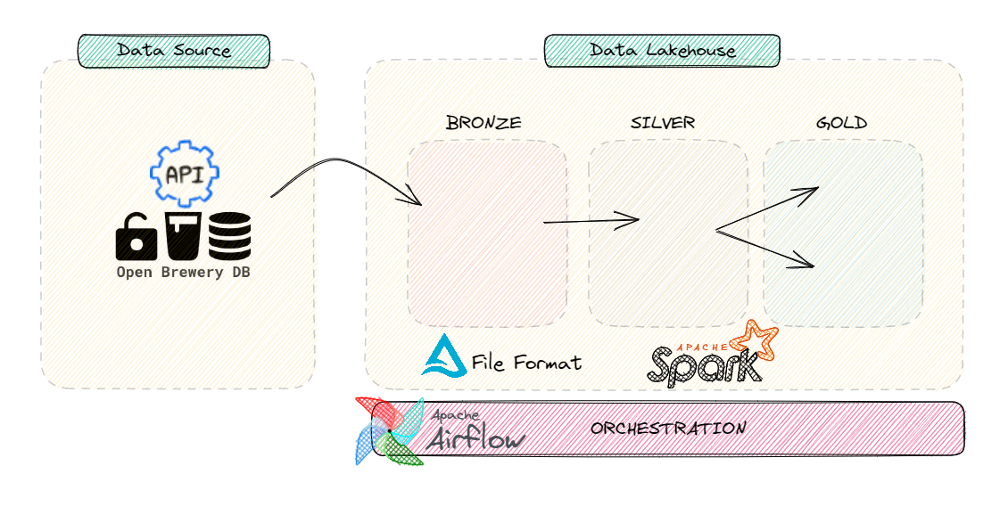
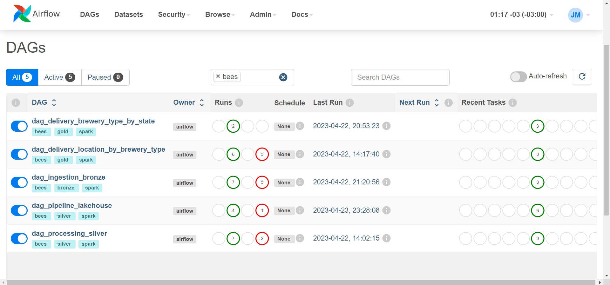
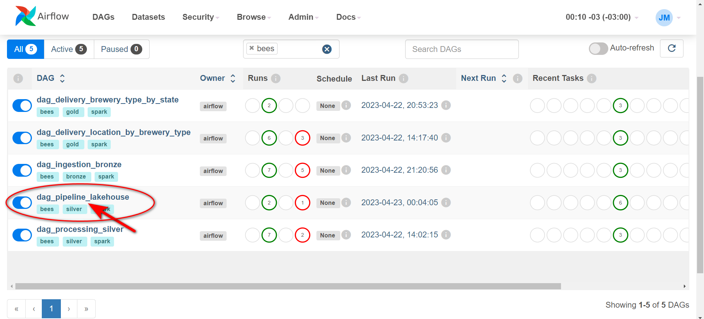
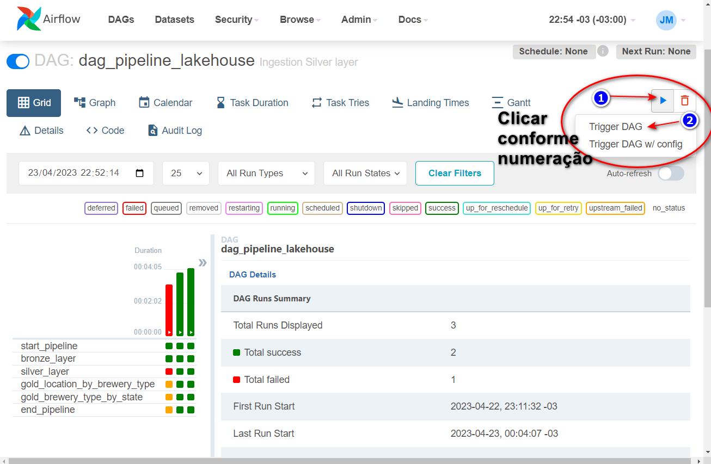
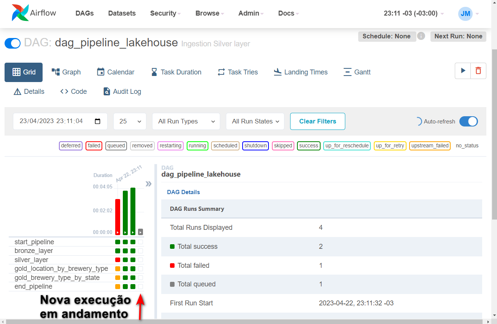
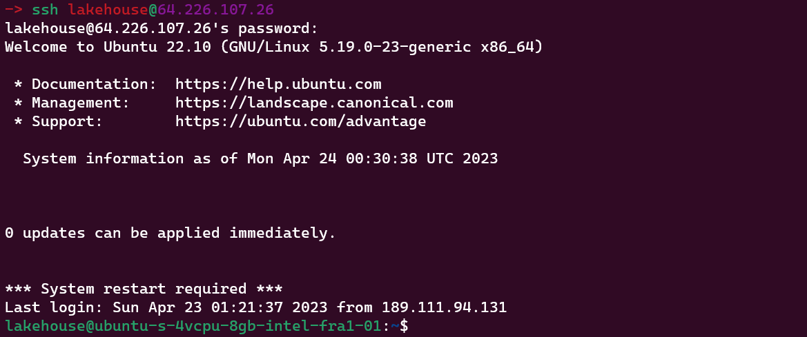

# Consumindo API e persistindo num Data Lakehouse


Criação de um Data Lakehouse utilizando arquitetura [Medallion Architecture](https://www.databricks.com/glossary/medallion-architecture)

Basicamente consumindo uma API, realizando tratamento dos dados e entregando tabelas agregadas.


## Arquitetura do fluxo


## Data Source
Para consumir uma API foi utilizado o [Projeto Open Brewery DB](https://www.openbrewerydb.org/) que são dados abertos de cervejarias.

## Data Lakehouse
Dividido nas seguintes camadas:

- ***Bronze*** - dados sem nenhuma transformação e inserido metadado
- ***Silver*** - dados com alguma transformação e inserido metadado
- ***Gold*** - dados agregados conforme regra de négocio

Para essa solução foi utilizado as seguintes ferramentas:
- ***Apache Spark*** - engine de processamento 
- ***Apache Airflow*** - orquestração das DAGs
- ***Delta Table*** - camada de armazenamento otimizada

## Estrutura de pasta
* dags
* scripts
    * spark
    * sql

Na pasta `dags` temos o código reponsável pela definição da DAG 

Na pasta `scripts/spark` temos o código pyspark responsável pela carga dos dados

Na pasta `scripts/sql` temos o *SELECT* para criação da visão de negócio


***

## Execução das DAGs
A carga das tabelas é realizado pela execução da DAG no Airflow, conforme os passos a seguir.

1. Acessando a interface do Airflow <p>
Clique no link `Airflow UI` para ser direcionado


2. Selecionado a DAG<p>
Clicar no link = `dag_pipeline_lakehouse` para acessar a DAG

3. Executando a DAG<p>
**Agora sim**, clique no play para iniciar a execução

4. Acompanhamento execução<p>
Uma nova coluna 🔲 de execução será exibida
<p>
Progresso da execução será sinalizada com a mudança na cor da coluna (:green_square: indica execução com sucesso)<p>


> **Aguardar a finalização de todos os steps.**


***
## :rocket: Acessando Storage

:closed_lock_with_key: Conectando na Virtual Machine<p>
Para verificar os arquivos gerados assim como a estrutura de pastas, será necessário conectar na máquina remota.

Abrir um terminal:
>_Máquina Windows instalar algum aplicativo para conexão ssh_.<p>
> Sugestão utilize o putty [download here](https://www.putty.org/)

#### Step by step 
1. Realizar conexão remota via SSH
```bash
-> ssh lahouse@xx.xxx.xxx.xx
# 👇 Após digitar a senha seu prompt deve ser alterado conforme tela. 👇
```


2. Ir para o diretório principal do lakehouse
```bash
lakehouse@ubuntu-s-4vcpu-8gb-intel-fra1-01:~$ cd lakehouse

# 📁 Árvore de pastas conforme as camadas da arquitetura
.
├── bronze
│   └── brewery
├── gold
│   ├── brewery_type_by_state
│   └── location_by_brewery_type
└── silver
    └── brewery
```
📌 Navegue entres as pastas para verificar os arquivos criados
***

<a href="https://www.digitalocean.com/?refcode=20e91ebaafe6&utm_campaign=Referral_Invite&utm_medium=Referral_Program&utm_source=badge"></a>
